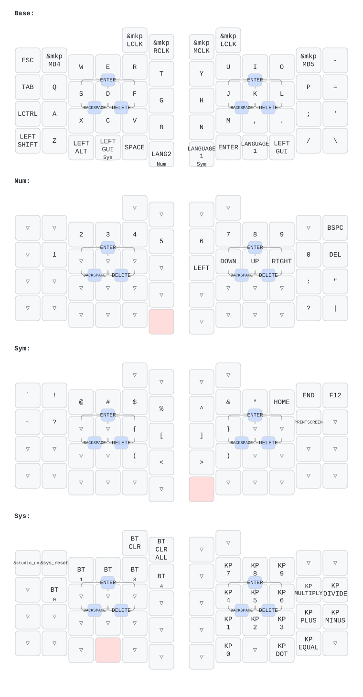

# PG1KB Protype ZMK Firmware

PG1KB Proto (Page One Keyboard Prototype) のZMKファームウェア用モジュールです。

## 現在の実装範囲

- Seeed Studio XIAO nRF52840 Plus向けの `pg1kb_proto_right` シールド
- Seeed Studio XIAO nRF52840 Plus向けの `pg1kb_proto_left` シールド
- 5行 x 6列の左右キーマトリクス
- 右手側はPAW3222トラックボールをSPI接続のZMK pointing deviceとして有効化
- 左手側はPAW3222トラックボールをSPI接続のZMK pointing deviceとして有効化
- 両手とも overlay の `#define` で PMW3610 に切り替え可能
- 右手側のBAT_CHECKピンを単4アルカリ乾電池の残量測定用ADCとして使用
- 右手側（central）は ZMK Studio 対応

## キーマップ



キーマップ定義は `boards/shields/pg1kb_proto/pg1kb_proto.keymap` です。SVG は `keymap-drawer/sync-keymap-drawer.sh` で更新できます。

## ZMK Studio

[ZMK Studio](https://zmk.studio/) からキーマップをリアルタイムに書き換えられます。

### アンロック

Studio から変更を書き込むにはキーボードのアンロックが必要です。`&studio_unlock` は **レイヤー3の左手上段外側の左のキー**に割り当ててあります。

### 予備レイヤー

Studio では devicetree に定義されていないレイヤーを新規追加できません。そのため `pg1kb_proto.keymap` に `status = "reserved"` の予備レイヤーを2つ（`extra_1` / `extra_2`）用意してあります。通常ビルドでは無視され、Studio有効ビルドでのみ「追加できるレイヤー」として現れます。もっと必要なら同じ形式で追加してください。

### 注意

Studio でキーマップを管理し始めると、以降 `pg1kb_proto.keymap` を編集して書き込んでも反映されなくなります。ファイル側の変更を反映したいときは Studio の "Restore Stock Settings" を実行してください（予備レイヤーの追加だけは例外で、Studio側の設定を消さずに増やせます）。

Studio が編集できるのはレイヤーとキーへのビヘイビア割り当てだけです。コンボ（`combo-bs` / `combo-del` / `combo-enter`）、入力プロセッサ、`lt` のタッピング設定などは引き続き devicetree 側で管理します。

## トラックボールセンサーの切替

左右の overlay 先頭にある `#define PG1KB_TRACKBALL_PAW3222` / `#define PG1KB_TRACKBALL_PMW3610` のうち、使う方の `#define` だけを有効にします。`.conf` を触る必要はありません。

```dts
#define PG1KB_TRACKBALL_PAW3222
// #define PG1KB_TRACKBALL_PMW3610
```

PAW3222 と PMW3610 は同じ SCLK / SDIO / CS / MOTION 配線を使いますが、Devicetree のプロパティ名が異なります。

| | PAW3222 (`pixart,paw3222`) | PMW3610 (`pixart,pmw3610`) |
| --- | --- | --- |
| 解像度 | `res-cpi` | `cpi` |
| 必須 | `irq-gpios` | `irq-gpios`, `evt-type`, `x-input-code`, `y-input-code` |
| 非対応 | `cpi` / `evt-type` / `x-input-code` / `y-input-code` | `res-cpi` |

## 右手側ピン配置

物理配線ラベルは 1 始まりで、ファームウェア上の `row0` が `R1`、`col0` が `C1` に対応します。

| 機能 | 配線ラベル | XIAO Plusピン | ZMK/Devicetree 指定 | nRF52840ピン |
| --- | --- | --- | --- | --- |
| row0 | R1 | D15 | `&gpio0 10` | P0.10 |
| row1 | R2 | D14 | `&gpio0 9` | P0.09 |
| row2 | R3 | D13 | `&gpio1 1` | P1.01 |
| row3 | R4 | D12 | `&gpio0 19` | P0.19 |
| row4 | R5 | D11 | `&gpio0 15` | P0.15 |
| col0 | C1 | D6 | `&xiao_d 6` | P1.11 |
| col1 | C2 | D4 | `&xiao_d 4` | P0.04 |
| col2 | C3 | D3 | `&xiao_d 3` | P0.29 |
| col3 | C4 | D2 | `&xiao_d 2` | P0.28 |
| col4 | C5 | D1 | `&xiao_d 1` | P0.03 |
| col5 | C6 | D0 | `&xiao_d 0` | P0.02 |
| PAW3222 MOTION | - | D10 | `&xiao_d 10` | P1.15 |
| PAW3222 CS | - | D17 | `&gpio1 3` | P1.03 |
| PAW3222 SCLK | - | D18 | `NRF_PSEL(SPIM_SCK, 1, 5)` | P1.05 |
| PAW3222 SDIO | - | D19 | `NRF_PSEL(SPIM_MOSI, 1, 7)` / `NRF_PSEL(SPIM_MISO, 1, 7)` | P1.07 |
| BAT_CHECK | - | D5 / A5 | `io-channels = <&adc 3>`、BAT_CHECK–AIN3 間に 10kΩ 直列 | P0.05 / AIN3 |

## 左手側ピン配置

左手側は **row のピン順だけが右手と逆**（右手は row0=D15→row4=D11、左手は row0=D11→row4=D15）で、col とトラックボールの4信号は右手と同一です。

| 機能 | XIAO Plusピン | ZMK/Devicetree 指定 | nRF52840ピン |
| --- | --- | --- | --- |
| row0 | D11 | `&gpio0 15` | P0.15 |
| row1 | D12 | `&gpio0 19` | P0.19 |
| row2 | D13 | `&gpio1 1` | P1.01 |
| row3 | D14 | `&gpio0 9` | P0.09 |
| row4 | D15 | `&gpio0 10` | P0.10 |
| col0 | D6 | `&xiao_d 6` | P1.11 |
| col1 | D4 | `&xiao_d 4` | P0.04 |
| col2 | D3 | `&xiao_d 3` | P0.29 |
| col3 | D2 | `&xiao_d 2` | P0.28 |
| col4 | D1 | `&xiao_d 1` | P0.03 |
| col5 | D0 | `&xiao_d 0` | P0.02 |
| PAW3222 MOTION | D10 | `&xiao_d 10` | P1.15 |
| PAW3222 CS | D17 | `&gpio1 3` | P1.03 |
| PAW3222 SCLK | D18 | `NRF_PSEL(SPIM_SCK, 1, 5)` | P1.05 |
| PAW3222 SDIO | D19 | `NRF_PSEL(SPIM_MOSI, 1, 7)` / `NRF_PSEL(SPIM_MISO, 1, 7)` | P1.07 |
| BAT_CHECK | D5 / A5 | `io-channels = <&adc 3>`、BAT_CHECK–AIN3 間に 10kΩ 直列 | P0.05 / AIN3 |

左手側は `col-offset` を付けず（論理 col 0-5）、`ZMK_SPLIT_ROLE_CENTRAL=n` の peripheral です。物理的な左右反転はマトリクストランスフォームの `map` 側で吸収しています。

## 電池残量測定

左右それぞれに単4アルカリ乾電池があり、どちらも各 XIAO の `P0.05_A5_D5_SCL` ピン（AIN3）をBAT_CHECKとして使います。残量はBLE Battery ServiceでPC側へ報告します。

左手側は split peripheral なので、自分で測った残量を `zmk_battery_state_changed` イベントとして右手側（central）へ転送します（peripheral 側に追加の設定は不要）。右手側では `CONFIG_ZMK_SPLIT_BLE_CENTRAL_BATTERY_LEVEL_FETCHING=y` と `CONFIG_ZMK_SPLIT_BLE_CENTRAL_BATTERY_LEVEL_PROXY=y` を有効にして、左手側の残量を追加のBattery Levelサービスとしてホストへ中継しています。ホスト側が複数バッテリーをどう扱うかはOS依存で、右手側のみ表示される場合があります。

残量計算には [zmk-feature-non-lipo-battery-management](https://github.com/sekigon-gonnoc/zmk-feature-non-lipo-battery-management) を使います。`pg1kb_proto_right.conf` では単4アルカリ向けに `1000mV = 0%`、`1500mV = 100%`、`1000mV` 以下を低電圧として設定しています。

## ライセンス

このモジュール自体は MIT ライセンスです。

依存コンポーネントのライセンスは以下の通りです：

| コンポーネント | ライセンス | 備考 |
| --- | --- | --- |
| [ZMK Firmware](https://github.com/zmkfirmware/zmk) | MIT | キーボードファームウェア本体 |
| [zmk-driver-paw3222](https://github.com/sekigon-gonnoc/zmk-driver-paw3222) | Apache-2.0 | PAW3222 トラックボールドライバー。元コードは Google LLC (Zephyr Project) 著作権、sekigon-gonnoc により改変 |
| [zmk-pmw3610-driver](https://github.com/badjeff/zmk-pmw3610-driver) | MIT | PMW3610 トラックボールドライバー。badjeff 著作権 |
| [zmk-feature-non-lipo-battery-management](https://github.com/sekigon-gonnoc/zmk-feature-non-lipo-battery-management) | MIT | 単4アルカリなど非LiPo電池向けの残量測定 |
